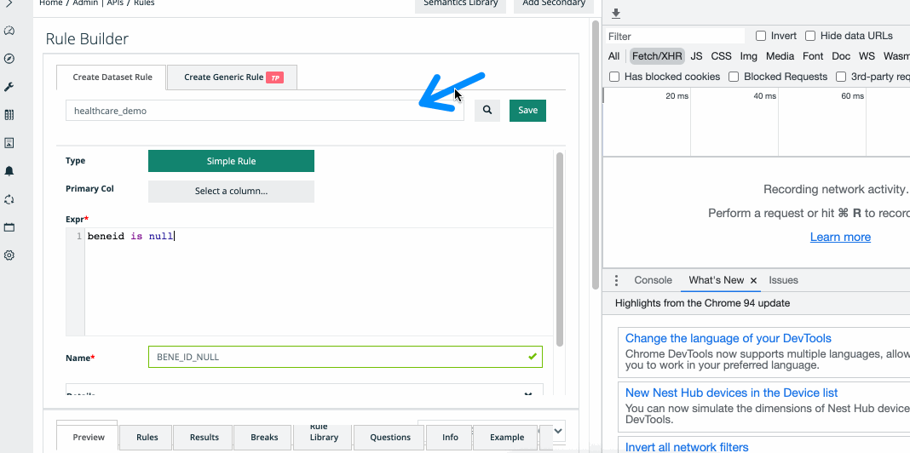
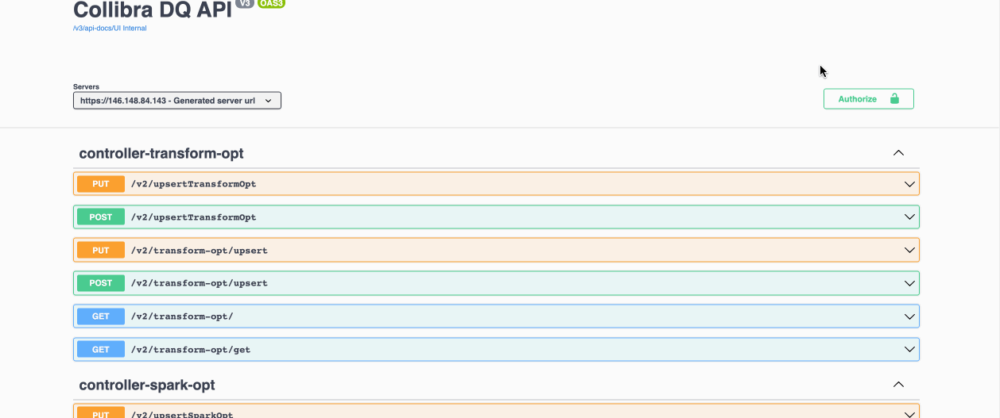

# Find the endpoint

### Find an API Endpoint

Any front-end action uses the API. You can find the corresponding endpoint using developer tools.&#x20;

In this example, we will look at the api call for `/create rule`.

#### Locate the call in Developer Tools

#### Locate the API in Swagger

All UI endpoints are the API and can be located in swagger. You can script against this externally as well.
