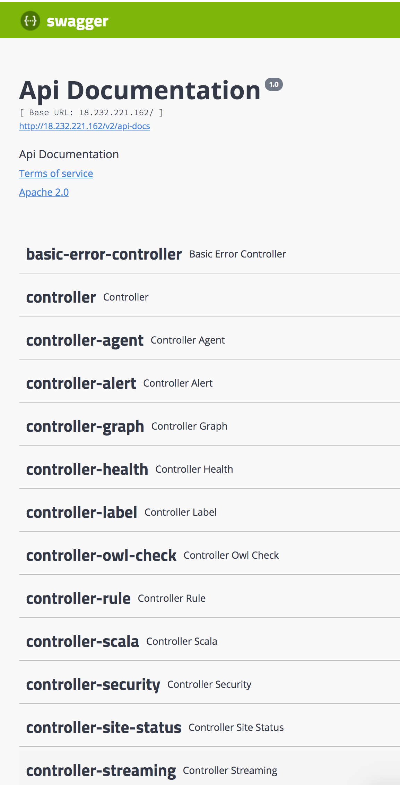

# Swagger

### Docs built into the application

Collibra DQ comes with full swagger support out of the box.

```
http://<YOUR_IP_ADDRESS>/swagger-ui.html
```

Swagger can be found in the application under the Admin section labeled APIs.

 (1).png>)

You will find a direct link to the Swagger page&#x20;

 (2).png>)

Toggle between Product API and Internal API&#x20;

 (1) (1).png>)


For example swagger API please visit - [http://\<YOUR\_IP>:9000/v2/api-docs?group=UI Internal](http://35.194.91.201:9003/v2/api-docs?group=UI%20Internal) &#x20;



