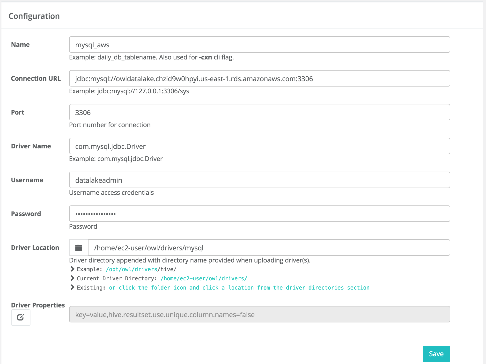

# DQ Job JDBC

Connect to any database via JDBC.

```bash
-q "select * from lake.stock_eod where date = '2017-01-20' " \
-u username -p password \
-c "jdbc:mysql://instance.chzid9w0hpyi.us-east-1.rds.amazonaws.com:3306" \
-rd "2017-01-20" \
-dc "date" \
-ds "stocks" \
-driver com.mysql.jdbc.Driver \
-lib "/home/ec2-user/owl/drivers/mysql/"
```



### Password Manager

You can configure Owl to call a script file to retrieve a password from a password manager vault or other storage container. The customer is responsible for generating a script to pull just the password and Owl will use that value dynamically when the connection is needed for the UI or when kicking off an Owlcheck.


In the connection dialog, select Password Manager from the Auth Type dropdown, and supply a user name. The script is the path to the .sh script on the machine where the web application is running, and the user account that runs Owl-web should be allowed to execute the script. You can either use the optional parameters or pass any parameters your script needs directly inline on the Script value.

### Fetch Size

It is important to consider the drivers fetch size when loading greater than 1 Million rows across the network.  Owl allows you to set this driver property in the WebApp but this is only for web interaction therefore "fetchsize" will not help here.  Owl also allows fetchsize in the OwlCheck by passing in a connection property.

#### CMD line

```
-connectionprops "fetchsize=3000"
```

#### Notebook

```
props.connectionProps.put("fetchsize", "3000")
```

## Parallel JDBC

For greater performance or moving large datasets across a network Owl supports parallel JDBC, which can be enabled by passing `numpartitions` to Owlcheck. This can be a 2-5X improvement in many cases.&#x20;

```bash
-lib "/opt/owl/drivers/mysql8/"
-cxn mysql
-q "select * from lake.nyse where trade_date = '${rd}' "
-rd 2018-01-01
-ds nyse
-columnname volume
-numpartitions 4
-lowerbound "0"
-upperbound "5000000000"
-usesql
```

Owl also supports auto parallelization, which will configure the `numPartitions` parameter for you based on the size of your data. This is enabled in the UI when you create a dataset using the Owlcheck wizard.


