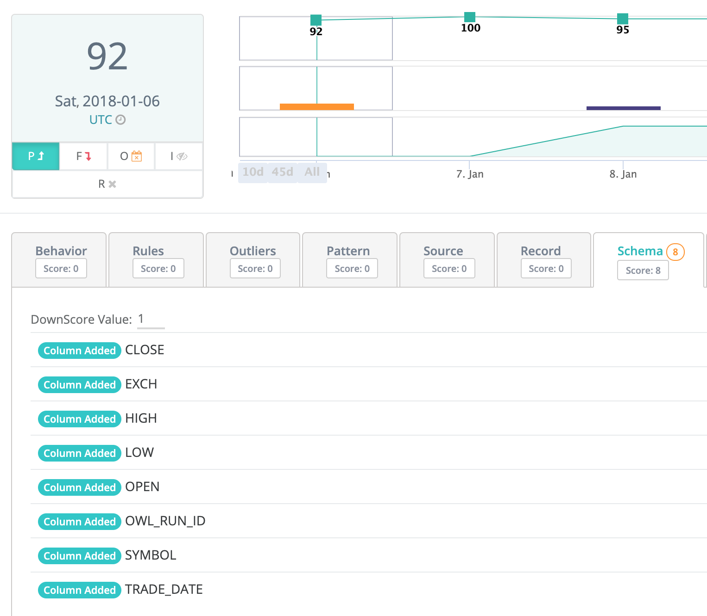

# Schema (automatic)

Dataset schemas are the columns or fields that define the dataset.  They are often located in the header row of a tabular file or database table.  However, JSON and XML are two examples of formats that include schema columns that are not in the header but rather nested throughout the document.  OwlDQ automatically without needing to turn on any features detects the schema columns as well as reads or infers their data types (varchar, string, double, decimal, int, date, timestamp etc...).  Owl observes each dataset so if a column is ever altered, removed or added it will automatically raise the event via its standard composite scoring system.

#### Scoring... Alerting... Schema Detection... Automatically  &#x20;

Schema Evolution is one of Owl's 9 DQ dimensions.  It can be an important measurement for data stewards to understand how the dataset is changing overtime.  The orange bar on the chart shows a change in schema and allows for drilling in over time.
