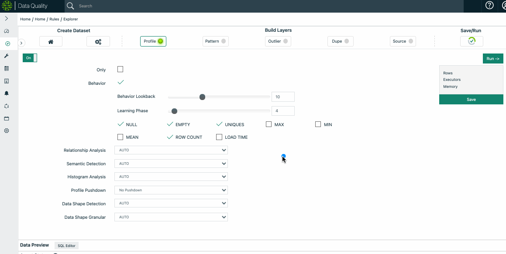
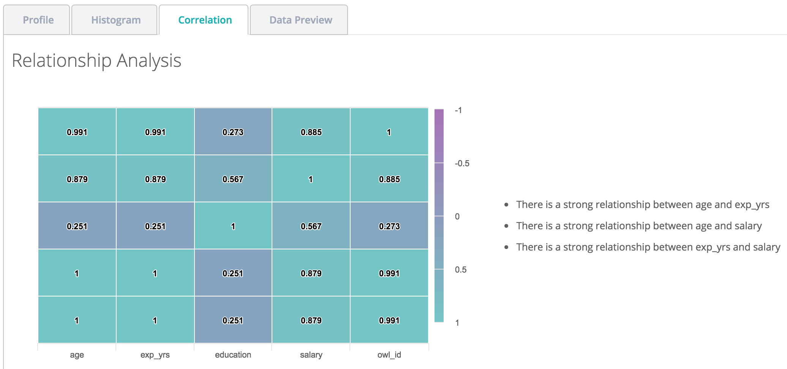
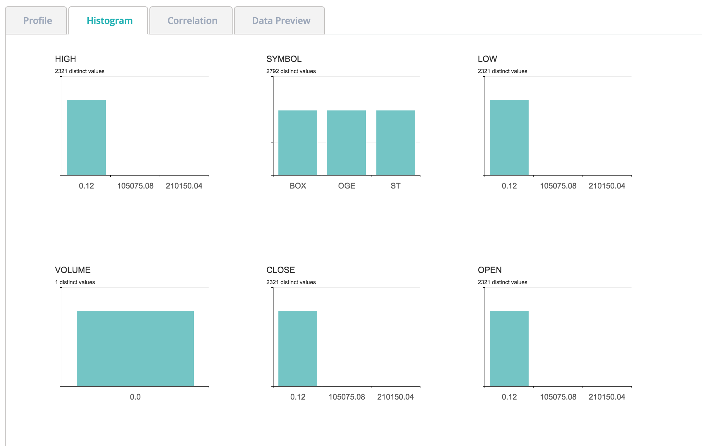

# Profile (automatic)


Users have the option to scan the entire dataset or users can apply custom filtering to select the depth (row filtering) and width (columns).&#x20;


### Select the Scope

You can find detailed instructions about [selecting the scope](more/explorer-2.md#select-the-scope-and-define-a-query) in the Explorer section. You can run limits, by time, or full table scans if you have enough resources.

### Select Options (or leave defaults)

### Save / Run

.gif>)

### View the Results

.gif>)

## Automatically Profile

Owl automatically profiles datasets over time to enable drill-in for detailed insights an automated data quality. A profile is just the first step towards an amazing amount of auto discovery. Visualize segments of the dataset and how how the dataset is changing over time.

Collibra DQ offers click or code options to run profiling.&#x20;

## Dataset Profile

Owl creates a detailed profile of each dataset under management. This profile will later be used to both provide insight and automatically identify data quality issues.

### Pushdown Profiling

Collibra DQ can compute the Profile of a dataset either via Spark (default) or the Data Warehouse (Profile Pushdown) where the data lives as the engine. When the Profile is computed using the datasource DBMS the user can choose two levels of pushdown:&#x20;

* Full Profile - Perform full profile calculation except for TopN&#x20;
* Count - Only perform row and column counts


The following DBMS systems are supported for "Profile Pushdown"

* Impala&#x20;
* Hive&#x20;
* Snowflake&#x20;
* Presto&#x20;
* Teradata&#x20;
* SQL Server&#x20;
* Postgres&#x20;
* Redshift&#x20;
* Mysql&#x20;
* Oracle&#x20;
* DB2&#x20;



Pushdown and parallel JDBC cannot be used together.  If you are using pushdown, do not select the parallel JDBC option.


## Profile Insights

By gathering a variety of different statistics, Owl's profile can provide a great deal of insight about the dataset. &#x20;


Profile includes a range of statistics

* Actual Datatype
* Discovered Datatypes
* Percent Null
* Percent Empty
* Percent Mixed Types
* Cardinality
* Minimum
* Maximum
* Mean
* TopN / BottomN
* Value Quartiles


## Sensitive Data Detection (Semantic)

Owl can automatically identify any types of common PII columns.&#x20;


Owl is able to detect the following types of PII

* EMAIL
* PHONE
* ZIP CODE
* STATE CD
* CREDIT CARD
* GENDER
* SSN
* IP ADDRESS
* EIN


Once detected, Owl will tag the column in the Profile as the discovered type as well as automatically apply a rule. If the user can choose to decline any discovered tag by simply clicking on it and confirming the delete action. This action can also remove the rule associated with the tag.

## Correlation Matrix (Relationship)

Discover hidden relationships and measure the strength of those relationships.

## Histograms

Often the first step in a data science project is to segment the data. Owl automatically does this using histograms.

## Data Preview

After profiling the data, for those users with appropriate rights, Owl provides a glimpse of the dataset. The Data preview tab also provides a some basic insights such as highlights of Data Shape issues and Outliers (if enabled), and Column Filtergram visualization.

