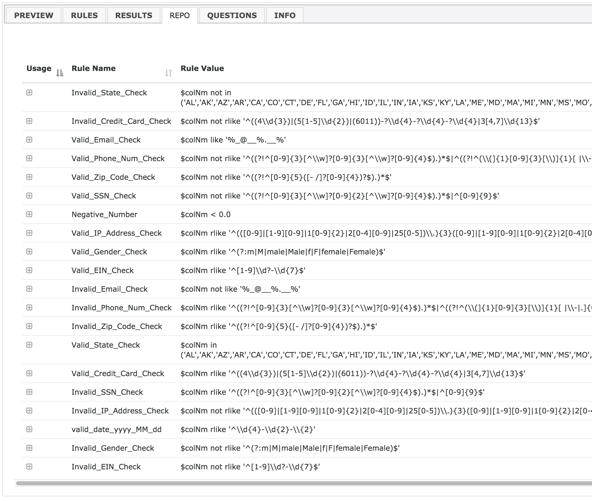

# Rules

### Rules.  Can't live with them, can't live without them.

Owl takes a strong stance that data should first be profiled, auto-discovered and learned before applying basic rules.  This methodology commonly removes thousands of rules that will never need to be written and evolve naturally overtime.  However there are still many cases to add a simple rule, complex rule or domain specific rule.  Simply search for any dataset and add a rule. You can use the optional Column Name/Category/Description to add meta-data to your rules for future reporting.

.png>)

Quick rules are another great way to apply rules at the click of a button in the preview tab.

.png>)

### Current Rule Set

Below is a list of one click rules that can be added to any dataset.  It is important to note that Owl often self identifies these columns and automatically provides the proper protection.

* Email
* Zip
* Credit Card
* SSN
* EIN
* State Code
* Phone
* Gender
* IP Address
* Date
* Int
* Double

### Global Shareable Rules

Owl allows a user to define a custom rule and expose it to other users to apply.

### Rule Templates

Create a rule once using our rule template builder and re-use the rule across any column on any dataset.  Owl will substitute the dataset and column that the rule applies to at runtime. This commonly saves hundreds of redundant rules that do the same thing but on different column names.

### Rule Repository

Owl shares all of it's out of the box rules with each user/tenant.  This makes it easy to get started quickly and let the team add common rules for specific use-cases.



### Query Builder

Query builder will help generate SQL for more complex rules. You can apply to one or two tables (Table A on left and Table B on right). For different joins, you can apply a key or matching condition as well. 


### Native SQL

.png>)

If you have rules already written in Oracle, Sybase, or DB2 syntax - Copy/Paste the rule directly into the Native SQL section. 

When creating a Native SQL rule, keep the following in mind:

* The SQL query must be a valid expression that can be run as a subquery. To avoid pulling large amounts of data into memory, Collibra DQ will wrap your expression so it only fetches the number of rows returned. Rules should be written such that the query returns the anomalous rows.
* The SQL query must take less than 30 minutes to run. It is recommended to use partitioned columns for efficiency.
* When testing the SQL query from the app, it is helpful if it take less than 30 seconds to run. You can add a limit to reduce query time, or test the query in your SQL Editor.

### Stat Rules

One really powerful technique is to access the profile statistics in your rules.  These are typically sub-second operations that do not require scanning or iterating.  There are several cases where SQL struggles to support rules, such as: isNull but not "null count" or nullRatio or nullPercent.  Or having access to types without doing crazy cast() operations.  These are simplified below, i.e. fname.$type == 'String'

```sql
select * from @dataset where 
fname.$type != 'String' AND $rowCount < 800
```

| Dataset Level Stat      | Rule Example             | Description                                    |
| ----------------------- | ------------------------ | ---------------------------------------------- |
| **$totalTimeInSeconds** | $totalTimeInSeconds > 25 | alert when DQ job runs longer than 25 seconds. |
| **$totalTimeInMinutes** | $totalTimeInMinutes > 5  | alert when DQ job runs longer than 5 mins.     |
| **$totalTimeInHours**   | $totalTimeInHours > 1    | alert when DQ job runs longer than 1 hour.     |
| **$rowCount**           | $rowCount < 9000         | alert when row count less than 9,000           |
| **$runId**              | $runId = '2020-01-24'    | use the ${rd} variable in rules                |

| Column Level Stat              | Rule Example                             | Description                                                                                                                                       |
| ------------------------------ | ---------------------------------------- | ------------------------------------------------------------------------------------------------------------------------------------------------- |
| **.$type**                     | fname.$type != 'String'                  | alert when fname is not a string                                                                                                                  |
| **.$min**                      | fname.$min > 'apple'                     | lexicographical sort works for strings and numbers                                                                                                |
| **.$minNum**                   | age.$minNum > 13                         | type casted to a numeric for simple number checks                                                                                                 |
| **.$max**                      | fname.$max > 'apple'                     |                                                                                                                                                   |
| **.$maxNum**                   | age.$maxNum > 13                         |                                                                                                                                                   |
| .**$uniqueCount**              | id.$uniqueCount != $rowCount             | alert when the uniqueCount of a field doesn't match the rowCount                                                                                  |
| **.$uniqueRatio             ** | gender.$uniqueRatio between .4 and .6    |                                                                                                                                                   |
| **.$nullRatio**                | lname.$nullRatio not between .4 and .6   | alert when the ratio of nulls no longer falls within acceptable range                                                                             |
| **.$nullPercent**              | lname.$nullPercent not between 40 and 60 | alert when the percent of nulls no longer falls within acceptable range                                                                           |
| **.$nullCount**                | lname.$nullCount >= 1                    | test for a single null                                                                                                                            |
| **.$emptyRatio**               | nc.$emptyRatio > 0.2                     | alert when the ratio of empties no longer falls within acceptable range                                                                           |
| **.$emptyPercent**             | nc.$emptyPercent > 20                    | alert when the percent of empties no longer falls within acceptable range                                                                         |
| **.$emptyCount**               |                                          |                                                                                                                                                   |
| **.$mixedTypeRatio**           | nc.$mixedTypeRatio > 0.2                 | ****                                                                                                                                              |
| **.$mixedTypePercent**         | nc.$mixedTypeRatio > 20                  | <p>alert when the percent of mixed data types </p><p>no longer falls within acceptable range. </p><p> i.e. Strings and Ints in the same field</p> |
| **.$mixedTypeCount**           | id.$mixedTypeCount >= 1                  |                                                                                                                                                   |


Known limitation.  Cannot combine stat rules or distribution rules with regex rules in the same rule.  Example car\__vin rlike '$\[asdf]\[0-9]' and car_vin.$uniqueCount_

### Distribution Rule

There is a common case in DQ where you want to know the distribution of a columns value.  Meaning if you have gender there may be an expectation that 40-60% are males and 40-60% are females if the dataset is large and represents the population.  This can be rather hard or expensive to express in vanilla SQL, but is very easy with the below syntax.

```sql
gender['Male'].$uniquePercent between 40 and 60
```

| Column Value Level  | Rule                                                   |
| ------------------- | ------------------------------------------------------ |
| **.$uniqueCount**   | credit_rating\['FAIR'].$uniqueCount > 7                |
| **.$uniquePercent** | credit_rating\['GOOD'].uniquePercent between 40 and 60 |


### Quick Tips

If joining more than one data source, make sure both sets of drivers are in the -lib. Or separately supply a -libsrc pointing to the appropriate directory/jar file location.

SQL Freeform uses Spark sql syntax. 

Native SQL uses your native DB syntax. The score is total break records / rows from owlcheck scan. 

