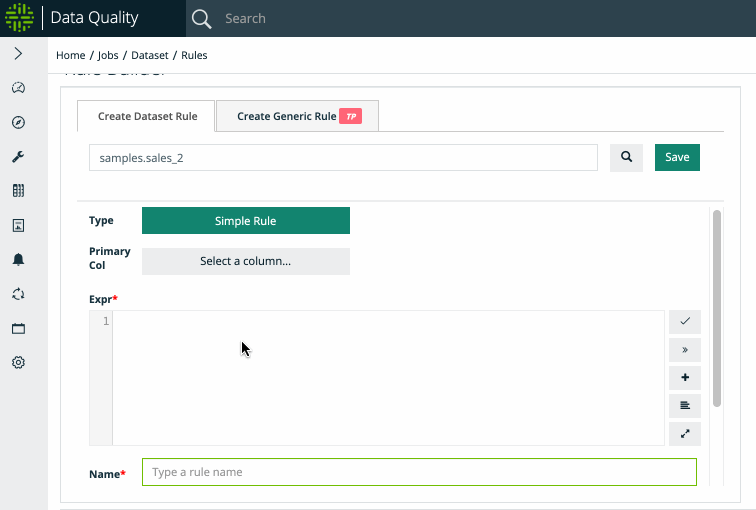

# Rules (user-defined)

### SQL Rule Engine

### Rules.  Can't live with them, can't live without them.

Owl takes a strong stance that data should first be profiled, auto-discovered and learned before applying basic rules.  This methodology commonly removes thousands of rules that will never need to be written and evolve naturally overtime.  However there are still many cases to add a simple rule, complex rule or domain specific rule.  Simply search for any dataset and add a rule. You can use the optional Column Name/Category/Description to add meta-data to your rules for future reporting.

.gif>)


Customized discovery routines can be run using the [rule library](./#rule-library) together with [data concepts and semantics.](data-concepts-and-semantics.md)


### Query Builder

Query builder will help generate SQL for more complex rules. You can apply to one or two tables (Table A on left and Table B on right). The query builder can help build up multi-part conditions.


As with any SQL generator, there are limitations for more complex scenarios.


### Break Records

Storing break records is only available for Freefrom and Simple rule types.  Rule library rules will use one of these types as well. &#x20;

Additional storage can be enabled using the -linkid flag.  This allows users to store complete sets of break records. Please refer to the [linkid section](../../dq-job-examples/owlcheck/owlcheck-linkid.md) for more details


Stat, Native, and Data Type (global) rules are not eligible for storing exception records. &#x20;


### Quick Tips

If joining more than one data source, make sure both sets of drivers are in the -lib. Or separately supply a -libsrc pointing to the appropriate directory/jar file location. Version 2021.11 and forward will use the -addlib for additional directories to add to the classpath.

Native SQL uses your native DB syntax. The score is total break records / rows from the scope (query / -q) of the defined DQ job.&#x20;

### Spark SQL

This is a complete list of Spark SQL operators and functions available. [https://spark.apache.org/docs/latest/api/sql/index.html](https://spark.apache.org/docs/latest/api/sql/index.html)

.gif>)
