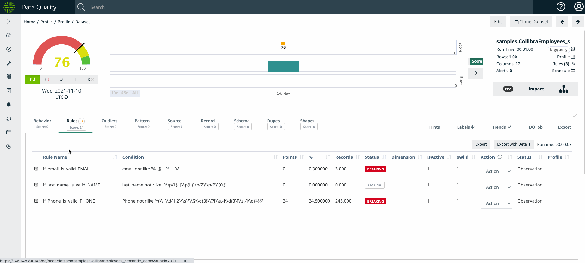
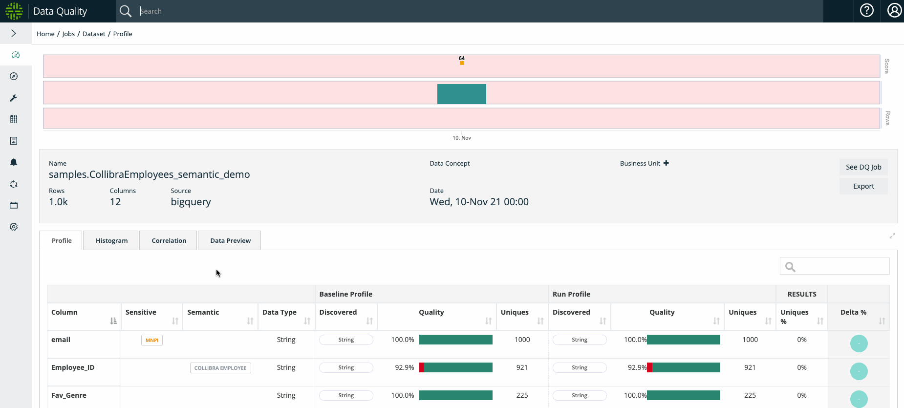
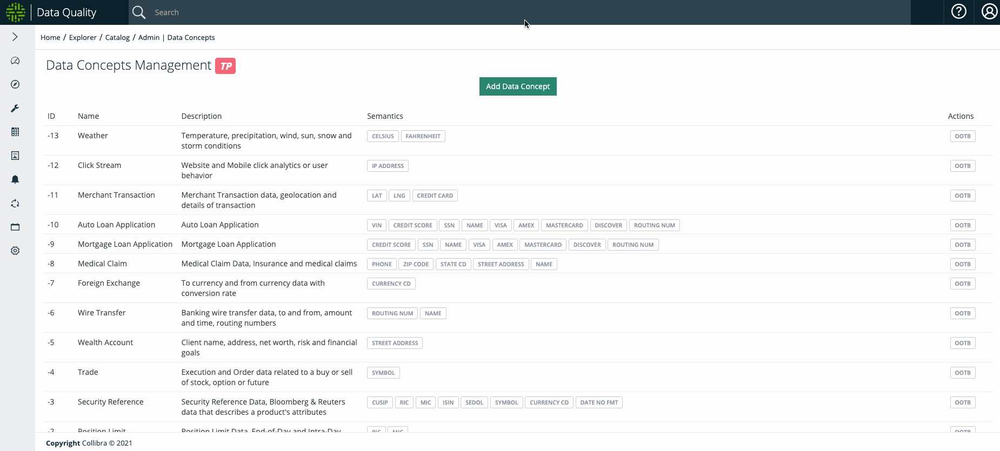
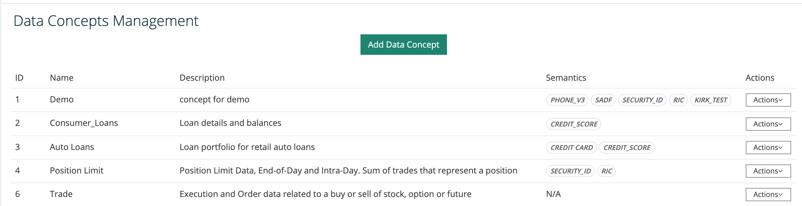
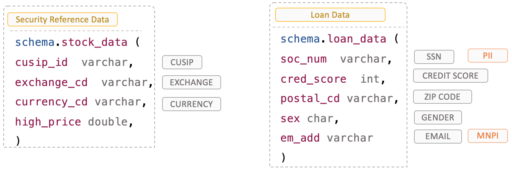
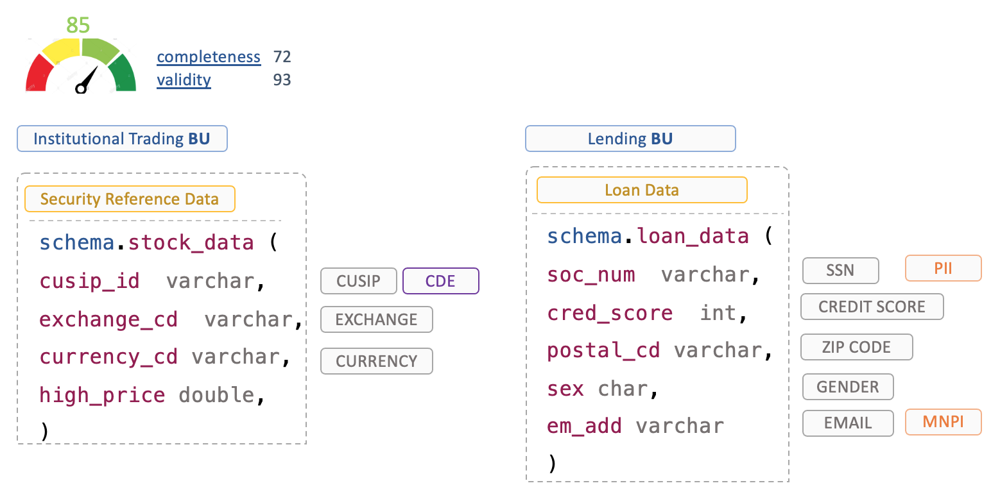

# Rule Discovery

## Data Concepts

A data concept is the class or family of a dataset for example:  _Loan Data, Stock Data, Position Limit Data, Retail Product Data, Patient Health Data, Interest Rate Data, etc... _By giving data classes or "classifying" datasets we can transfer common understanding, rules and ML to datasets. This powerful technique allows a data steward to set up concepts once and enables the entire organization the ability to unify and standardize on common rules and terms, solving many metadata scale challenges.


Dataset Level

**Security Reference Data **- Bloomberg financial data**                                                                      Home Loan Data** - Mortgage application data


## Semantics


Column Level

EMAIL, ZIP CODE, SSN, CUSIP, GENDER, ADDRESS, CURRENCY CD, SKU, EIN, IP ADDRESS, PHONE, LICENSE, VIN, CREDIT CARD


A semantic is the "semantic type" of a column or attribute of a dataset.  All columns have a physical type such as String, Int, Date etc... but the semantic understanding of what type of String is in the column can be very important.  I also allows us to enforce DQ validation rules out of the box.&#x20;

Owl's semantic scanning self identifies standard columns and automatically provides the proper protection. This makes it easy to get started adding common rules for specific use-cases.&#x20;

**Owl offers out of the box rules for 1-click rule creation**

## Sensitive Data


Column Level

**PII** - personally identifiable information                                                                                             **MNPI** - materially non public information\
**PCI** - credit information like a credit card number                                                                              **PHI** - HIPAA medical information


## Data Discovery: The Power of Combining All Three into One Domain&#x20;



Now imagine if you could classify your datasets as concepts, then automatically have all the columns be recognized semantically(with validation rules in place) as well as have the columns labeled with sensitivity tags.  It might look something like the below.

## Steps To Use

### Step 1: Create DQ Job with Semantic On

To start, create a new DQ Job and select Semantic ON on the Profile options page

.gif>)

### Step 2: In Catalog, select and apply your Data Concept

Navigate to your dataset in **Catalog** and select the Data Concept you would like to apply with the **Actions **dropdown menu.

See below sections on how to **Administering Data Concepts **as well as how to** Create and Manage Semantics**

.gif>)

### Step 3: Rerun your DQ Job with applied Data Concept

Please rerun your DQ Job so that Collibra DQ can 1) profile your data, 2) auto-generate the rules based on the Semantics under the Data Concept, and 3) highlight any break records.

### Success! Review Findings

On the Profile page, please observe the newly tagged Semantics on the applicable columns

On the DQ Job page, please browse your newly created rules based on Semantics as well as any corresponding rule breaks

## Creating and Managing Semantics

Create, test, and manage your Semantics in Collibra DQ in your **Rule Builder** wizard on the **Create Generic Rule** tab. Below is an example of creating a RegEx Semantic

.gif>)

## Administering Data Concepts

Setup your data concepts once and let the entire organization benefit by unifying all datasets to a common understanding in the admin Data Concepts page.&#x20;

## Physical Schemas to Semantics

Below you can see the benefit of organized metadata.  PDEs or `physical data elements` organized/tagged by semantics.  This allows for sub-second searches while in catalog or searching for data to figure out where all your PII data lives, or what systems have "loan data".

Above you can see Data Concepts in Yellow, Semantics in Gray and Sensitive labels in Orange.  Enabling you to organize all your data in classes, search and discover types no matter what system they live in or what the PDE column name is.  Transforming technical types into business metadata.

## Business Unit Roll up Reporting

Now that we have all PDEs discovered and tagged and rolled up into business terms, we can roll up technical assets like database tables and files into business reports across departments and non technical concepts.

