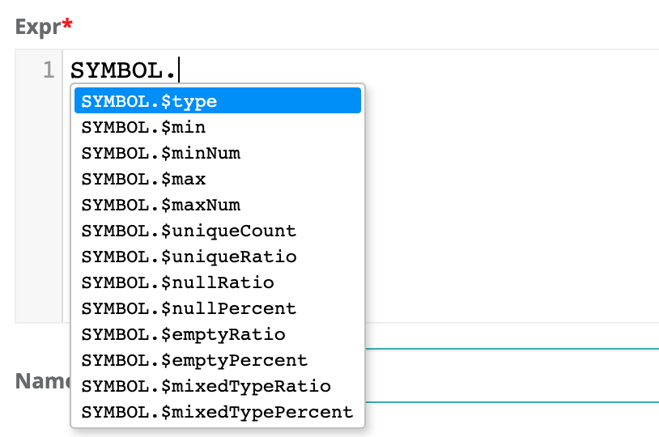

# Stat Rules

One really powerful technique is to access the profile statistics in your rules.  These are typically sub-second operations that do not require scanning or iterating.  There are several cases where SQL struggles to support rules, such as: isNull but not "null count" or nullRatio or nullPercent.  Or having access to types without doing crazy cast() operations.  These are simplified below, i.e. fname.$type == 'String'

```sql
select * from @dataset where 
fname.$type != 'String' AND $rowCount < 800
```

| Dataset Level Stat      | Rule Example             | Description                                    |
| ----------------------- | ------------------------ | ---------------------------------------------- |
| **$totalTimeInSeconds** | $totalTimeInSeconds > 25 | alert when DQ job runs longer than 25 seconds. |
| **$totalTimeInMinutes** | $totalTimeInMinutes > 5  | alert when DQ job runs longer than 5 mins.     |
| **$totalTimeInHours**   | $totalTimeInHours > 1    | alert when DQ job runs longer than 1 hour.     |
| **$rowCount**           | $rowCount < 9000         | alert when row count less than 9,000           |
| **$runId**              | $runId = '2020-01-24'    | use the ${rd} variable in rules                |

| Column Level Stat              | Rule Example                             | Description                                                                                                                                       |
| ------------------------------ | ---------------------------------------- | ------------------------------------------------------------------------------------------------------------------------------------------------- |
| **.$type**                     | fname.$type != 'String'                  | alert when fname is not a string                                                                                                                  |
| **.$min**                      | fname.$min > 'apple'                     | lexicographical sort works for strings and numbers                                                                                                |
| **.$minNum**                   | age.$minNum > 13                         | type casted to a numeric for simple number checks                                                                                                 |
| **.$max**                      | fname.$max > 'apple'                     |                                                                                                                                                   |
| **.$maxNum**                   | age.$maxNum > 13                         |                                                                                                                                                   |
| .**$uniqueCount**              | id.$uniqueCount != $rowCount             | alert when the uniqueCount of a field doesn't match the rowCount                                                                                  |
| **.$uniqueRatio**              | gender.$uniqueRatio between .4 and .6    |                                                                                                                                                   |
| **.$nullRatio**                | lname.$nullRatio not between .4 and .6   | alert when the ratio of nulls no longer falls within acceptable range                                                                             |
| **.$nullPercent**              | lname.$nullPercent not between 40 and 60 | alert when the percent of nulls no longer falls within acceptable range                                                                           |
| **.$nullCount**                | lname.$nullCount >= 1                    | test for a single null                                                                                                                            |
| **.$emptyRatio**               | nc.$emptyRatio > 0.2                     | alert when the ratio of empties no longer falls within acceptable range                                                                           |
| **.$emptyPercent**             | nc.$emptyPercent > 20                    | alert when the percent of empties no longer falls within acceptable range                                                                         |
| **.$emptyCount**               |                                          |                                                                                                                                                   |
| **.$mixedTypeRatio**           | nc.$mixedTypeRatio > 0.2                 | ****                                                                                                                                              |
| **.$mixedTypePercent**         | nc.$mixedTypeRatio > 20                  | <p>alert when the percent of mixed data types </p><p>no longer falls within acceptable range. </p><p> i.e. Strings and Ints in the same field</p> |
| **.$mixedTypeCount**           | id.$mixedTypeCount >= 1                  |                                                                                                                                                   |



Known limitation.  Cannot combine stat rules or distribution rules with regex rules in the same rule.  Example car\__vin rlike '$\[asdf]\[0-9]' and car\_vin.$uniqueCount_

### Distribution Rule

There is a common case in DQ where you want to know the distribution of a columns value.  Meaning if you have gender there may be an expectation that 40-60% are males and 40-60% are females if the dataset is large and represents the population.  This can be rather hard or expensive to express in vanilla SQL, but is very easy with the below syntax.

```sql
gender['Male'].$uniquePercent between 40 and 60
```

| Column Value Level  | Rule                                                    |
| ------------------- | ------------------------------------------------------- |
| **.$uniqueCount**   | credit\_rating\['FAIR'].$uniqueCount > 7                |
| **.$uniquePercent** | credit\_rating\['GOOD'].uniquePercent between 40 and 60 |


###
