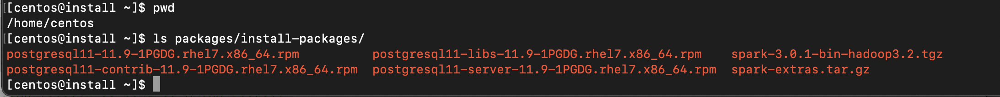

# Standalone Install

## Step 0. Setup Tutorial Assumptions

We assume that a server running Centos 7 or RHEL 7 is setup and ready to install DQ in the home directory (base path: `OWL_BASE`) under subdirectory `owl`(install path: `$OWL_BASE/owl`). There is no requirement for DQ to be installed in the home directory, but the DQ Full Installation script may lead to permission-denied issue during local Postgres server installation if paths other than home directory is used. If so, please adjust your directory permission to allow the installation script a write access to the Postgres data folder.

This tutorial assumes that you are installing DQ on a brand new compute instance on Google Cloud Platform. Google Cloud SDK setup with proper user permission is assumed. This is optional, as you are free to create Full Standalone Installation setup on any cloud service provider or on-premise.

Please refer to the _**GOAL**_** ** paragraph for the intended outcome of each step and modify accordingly


The full install package supports Centos 7 and RHEL 7. If another OS flavor is required, please follow the basic install process.


```
# Create new GCP Compute Instance named "install"
gcloud compute instances create install \
    --image=centos-7-v20210701 \
    --image-project=centos-cloud \
    --machine-type=e2-standard-4

# SSH into the instance as user "centos"
gcloud compute ssh --zone "us-central1-a" --project "gcp-example-project" "centos@full-standalone-installation"
```


**GOAL**

1. Create a new compute instance on a cloud provider (if applicable)
2. Access the server where DQ will be installed.&#x20;


## Step 1. Download DQ Full Package

Download full package tarball using the signed link to the full package tarball provided by the DQ Team. Replace `<signed-link-to-full-package>` with the link provided.

```
### Go to the OWL_BASE (home directory of the user is most common)
### This example we will use /home/owldq installing as the user owldq

cd /home/owldq 

### Download & untar
curl -o dq-full-package.tar.gz "<signed-link-to-full-package>"
tar -xvf dq-full-package.tar.gz

### Clean-up unnecessary tarball (optional)
rm dq-full-package.tar.gz
```


**GOAL**

1. Download the full package tarball and place it in the `$OWL_BASE` (home directory). Download via `curl` or upload directly via FTP. The tarball name is assumed to be `dq-full-package.tar.gz`for sake of simplicity.
2. Untar`dq-full-package.tar.gz` to `OWL_BASE`.


## Step 2. Install DQ + Postgres + Spark

First set some variables for `OWL_BASE` (where to install DQ. In this tutorial, you are already in the directory that you want to install), `OWL_METASTORE_USER` (the Postgres username used by DQ Web Application  to access Postgres storage), and `OWL_METASTORE_PASS` (the Postgres password used by DQ Web Application  to access Postgres storage).&#x20;

```
### base path that you want owl installed. No trailing

export OWL_BASE=$(pwd)
export OWL_METASTORE_USER=postgres
export OWL_METASTORE_PASS=password
```


The default username and password for Postgres server that will be installed as part of the tutorial is `postgres`/`password` (the installation script takes these default values). If you want to change these values, you must install Postgres separately and configure Postgres permissions independently. If so, skip step #2 and perform step #3 instead.


`dq-package-full.tar.gz` that you untarred contains installation packages for Java 8, Postgres 11, and Spark. There is no need to download these components. These off-line installation components are located in `$(pwd)/package/install-packages` .



One of the files extracted from the tarball is `setup.sh`. This script installs DQ and the required components. If a component already exist (e.g. Java 8 is already installed and `$JAVA_HOME` is set), then that component is not installed (i.e. Java 8 installation is skipped).&#x20;

To control which components are installed, use `-options=...`parameter. The argument provided should be comma-delimited list of components to install (valid inputs: `spark`, `postgres`, `owlweb`, and `owlagent`. `-options=postgres,spark,owlweb,owlagent` means "install Postgres, Spark pseudo cluster, Owl Web Application, and Owl Agent". Note that Java is not part of the options. Java 8 installation is automatically checked and installed/skipped depending on availability.&#x20;

You must at minimum specify `-options=spark,owlweb,owlagent` if you independently installed Postgres or using an external Postgres connection (as you can see in Step #3 if you choose that installation route)

```
### The following installs PostgresDB locally as part of OwlDQ install

./setup.sh \
    -owlbase=$OWL_BASE \
    -user=$OWL_METASTORE_USER \
    -pgpassword=$OWL_METASTORE_PASS \
    -options=postgres,spark,owlweb,owlagent
```


If prompted to install Java 8 because you do not have Java 8 installed, accept to install from local package.



You will be prompted for where to install Postgres like the following image:

```
Postgres DB needs to be intialized. Default location = <OWL_BASE>/postgres/data
to change path please enter a FULL valid path for Postgres and hit <enter>
DB Path [ <OWL_BASE>/owl/postgres/data ] = 
```

If the data files for the Postgres database need to be hosted at a specific location, provide it during this prompt. **Make sure the directory is writable**. Otherwise, just press \<Enter> to install the data files into `$OWL_BASE/owl/postgres/data`. The default suggested path does not have permission issue if you chose home directory as `OWL_BASE`


If no exceptions occurred and installation was successful, then the process will complete with the following output.

```
installing owlweb
starting owlweb
starting owl-web
installing agent
not starting agent
install complete
please use owl owlmanage utility to configure license key and start owl-agent after owl-web successfully starts up
```


**GOAL**

1. Specify `OWL_BASE` path where DQ will be installed and specify Postgres environment variables
2. &#x20;Install DQ Web with Postgres and Spark linked to DQ Agent (**all files will be in `$OWL_BASE/owl` sub-directory**) using `setup.sh` script provided. \
   The location of `OWL_BASE` and Postgres are configurable, but we advise you to take the defaults.


## Step 3_._ Install DQ + Spark and use existing Postgres (advanced)


Skip Step 3 if you opted to install Postgres and performed Step 2 instead.



We only recommend Step 3 over Step 2 for advanced DQ Installer


If you have already installed DQ from the previous step, then skip this step. This is only for those who want to use external Postgres (e.g. use GCP Cloud SQL service as the Postgres metadata storage). If you have an existing Postgres installation, then everything in the previous step applies except the Postgres data path prompt and the `setup.sh` command

Refer to the Step #2 for details on what `OWL_BASE`, `OWL_METASTORE_USER` , and `OWL_METASTORE_PASS` are.

```
# base path that you want owl installed. No trailing

export OWL_BASE=$(pwd)
export OWL_METASTORE_USER=postgres
export OWL_METASTORE_PASS=password
```

Run the following installation script. Note the missing "postgres" in `-options` and new parameter `-pgserver`. This `-pgserver` could point to any URL that the standalone instance has access to.

```
# The following does not install PostgresDB and 
# uses existing PostgresDB server located in localhost:5432 with "postgres" database
./setup.sh \
    -owlbase=$OWL_BASE \
    -user=$OWL_METASTORE_USER \
    -pgpassword=$OWL_METASTORE_PASS \
    -options=spark,owlweb,owlagent \
    -pgserver="localhost:5432/postgres"
```

The database named `postgres` is used by default as DQ metadata storage. Changing this database name is out-of-scope for Full Standalone Installation. Contact DQ Team for assistance.


**GOAL**

1. Specify `OWL_BASE` path where DQ will be installed and specify Postgres environment variables
2. &#x20;Install DQ Web and Spark linked to DQ Agent (**all files will be in `$OWL_BASE/owl` sub-directory**) using `setup.sh` script provided and link DQ Web to an existing Postgres server.


## Step 4. Verify DQ and Spark Installation

The installation process will start the DQ Web Application. This process will handle initializing the Postgres metadata storage schema in Postgres (under the database named `postgres`). This process must complete successfully before the DQ Agent can be started. Wait approximately 1 minute for the Postgres metadata storage schema to be populated. If you can access DQ Web using `<url-to-dq-web>:9000` using a Web browser, then this means you have successfully installed DQ.


Next, verify that the Spark Cluster has started and is available to run DQ checks using `<url-to-dq-web>:`8080 Take note of the Spark Master url (starting with `spark://...`). This will be required during DQ Agent configuration.


## Step 5. Set License Key

In order for DQ to run checks on data, the DQ Agent must be configured with a license key. Replace `<license-key>` with a valid license key provided by Collibra.

```
cd $OWL_BASE/owl/bin
./owlmanage.sh setlic=<license-key>

# expected output:
# > License Accepted new date: <expiration-date>
```

## Step 6. Set DQ Agent Configuration

Next, start the DQ Agent process to enable processing of DQ checks.

```
cd $OWL_BASE/owl/bin
./owlmanage.sh start=owlagent

# Verify "agent.properties" file is created
cd $OWL_BASE/owl/config
```

When the script successfully runs, `$OWL_BASE/owl/config` folder will contain a file called `agent.properties`. This file contains agent id # of agents installed in this machine. Since this is the first non-default agent installed, the expected agent id is 2. Verify `agent.properties` file is created. Your`agent.properties` is expected to have different timestamp, but you should see `agentid=2`

```
cd $OWL_BASE/owl/config
cat agent.properties

# expected output:
> #Tue Jul 13 22:26:19 UTC 2021
> agentid=2
```

Once the DQ Agent starts, it needs to be configured in DQ Web in order to successfully submit jobs to the local Spark (pseudo) cluster.

The new agent has been setup with the template base path `/opt` and install path `/opt/owl`. The `owlmanage.sh start=owlagent` script does not respect  `OWL_BASE` environment. **We need to edit the Agent Configuration to follow our** `OWL_BASE`

Follow the steps on [How To Configure Agent via UI](https://docs.owl-analytics.com/installation/agent-configuration#how-to-configure-agent-via-ui) page to configure the newly created DQ Agent and edit the following parameters in DQ Agent #2.&#x20;

* Replace all occurrence of `/opt/owl` with your `$OWL_BASE/owl/`in **Base Path**, **Collibra DQ Core JAR**, **Collibra DQ Core Logs**, **Collibra DQ Script**, and **Collibra DQ Web Logs**.
  * Note that **Base Path** here does not refer to `OWL_BASE`
* Replace **Default Master** value with the Spark URL from Fig 3
* Replace **Number of Executors(s)**, **Executor Memory (GB)**, **Driver Memory (GB)** to a reasonable default (depending on how large your instance is)

Refer to [Agent Configuration Parameters](https://docs.owl-analytics.com/installation/agent-configuration#agent-configuration-parameters) for parameters descriptions.

.png>)

## Step 7. Create DB Connection for DQ Job

Follow the steps on [How to Add DB Connection via UI](https://docs.owl-analytics.com/installation/agent-configuration#how-to-add-db-connection-via-ui) page to add `metastore` database connection. For demo purposes, we will run a DQ Job against local DQ Metadata Storage.&#x20;

Follow the steps on [How To Link DB Connection to Agent via UI](https://docs.owl-analytics.com/installation/agent-configuration#how-to-link-db-connection-to-agent-via-ui) page to configure newly created DQ Agent.&#x20;

Click the compass icon in the navigation pane to navigate to the Explorer Page. Click on the "metastore" connection, select the "public" schema, and then select the first table in the resulting list of tables. Once the preview and scope tab comes up, click "Build Model". When the Profile page comes up, click the "Run" button.


On the Run page, click the "Estimate Job" button, acknowledge the resource recommendations, and then click the "Run" button.


Click the clock icon in the navigation pane to navigate to the Jobs Page. Wait 10 seconds and then click refresh several times with a few seconds in between clicks. The test DQ check should show and progress through a sequence of activities before settling in "Finished "status.


## Generally Available Build Versions

* Default Build = Spark 2.3.0
* Spark 2.4.5
* Spark 3.0.1
* HDP 3
* CDH5
* CDH6-NOLOG
* K8s

### Helpful Commands

```
### Setting permissions on your pem file for ssh access

chmod 400 ~/Downloads/ssh_pem_key
```

```
### Postgres data directly initialization failed 
### Postgres permission denied errors
### sed: can't read /home/owldq/owl/postgres/data/postgresql.conf: Permission denied

sudo rm -rf /home/owldq/owl/postgres
chmod -R 755 /home/owldq

### Reinstall just postgres
./setup.sh -owlbase=$OWL_BASE -user=$OWL_METASTORE_USER -pgpassword=$OWL_METASTORE_PASS -options=postgres
```

```
### Spark standalone permission denied after using ./start-all.sh 

ssh-keygen -t rsa -N "" -f ~/.ssh/id_rsa
cat ~/.ssh/id_rsa.pub >> ~/.ssh/authorized_keys
```

```
### Changing permissiongs on individual log files 

sudo chmod 777 /home/owldq/owl/pids/owl-agent.pid
sudo chmod 777 /home/owldq/owl/pids/owl-web.pid
```

```
### Getting the hostname of the instance

hostname -f
```

```
### Checking worker nodes disk space 

sudo du -ah | sort -hr | head -5
sudo find /home/owldq/owl/spark/work/* -mtime +1 -type f -delete
```

```
### Redirect Spark scratch to another location
SPARK_LOCAL_DIRS=/mnt/disks/sdb/tmp

### Set Spark to delete older files
export SPARK_WORKER_OPTS="${SPARK_WORKER_OPTS} -Dspark.worker.cleanup.enabled=true -Dspark.worker.cleanup.interval=1800 -Dspark.worker.cleanup.appDataTtl=3600"

```

Or change Spark storage with an agent configuration `-conf spark.local.dir=/home/owldq/owl/owltmp`

.png>)

## Troubleshooting Tip: Add Spark Home Environment Variables to Profile

```
### Adding ENV variables to bash profile

### Variable 'owldq' below should be updated wherever installed e.g. centos

vi ~/.bash_profile
export SPARK_HOME=/home/owldq/owl/spark
export PATH=$SPARK_HOME/bin:$PATH

### Add to owl-env.sh for standalone install 

vi /home/owldq/owl/config/owl-env.sh 
export SPARK_HOME=/home/owldq/owl/spark
export PATH=$SPARK_HOME/bin:$PATH
```

## Check Processes are Running

```
### Checking PIDS for different components

ps -aef|grep postgres
ps -aef|grep owl-web
ps -aef|grep owl-agent
ps -aef|grep spark

```

## Starting Components

```
### Restart different components 

cd /home/owldq/owl/bin/
./owlmanage.sh start=postgres
./owlmanage.sh start=owlagent
./owlmanage.sh start=owlweb

cd /home/owldq/owl/spark/sbin/
./stop-all.sh
./start-all.sh
```

## Configuration Options

### Setup.sh arguments <a href="#setup.sh-arguments" id="setup.sh-arguments"></a>

**-non-interactive** skip asking to accept JAVA license agreement

**-skipSpark** skips the extraction of spark components

**-stop** do not automatically start up all components (orient,owl-web,zeppelin,postgres)

**-port=** set owlweb application to use defined port

**-user=** Optional Parameter (default will be current user) set the user to run owl as.

\-**owlbase=** set base path to where you want owl installed

**-owlpackage=** Optional Parameter (default is current working directory) set owl package directory

**-help** display this help and exit

**-options=** the different owl components to install (comma separated list) --- owlagent,owlweb,zeppelin,postgres,orient,spark

**-pgpassword=** password to use to set for the postgres metastore (unattended install)

**-pgserver=** name of the postgres server example = owl-postgres-host.example.com:5432/owldb (unattended install)

**-opassword=** password for the orient graph DB (unattended install)

#### Example: <a href="#example" id="example"></a>

* The Owl tar ball has been extracted to this folder on my EC2 Instance: _**/home/ec2-user/packages/**_
* Owl will be running as the _**ec2-user**_
* The owl-web application will run on port _**9000**_
* The base location for the setup.sh script to create the owl folder and place all content under owl will be: _**/home/ec2-user/**_

_**./setup.sh -port=9000 -user=ec2-user -owlbase=/home/ec2-user -owlpackage=/home/ec2-user/package**_

#### Example installing just the agent (perhaps on an Edge node of a hadoop cluster): <a href="#example-installing-just-the-agent-perhaps-on-an-edge-node-of-a-hadoop-cluster" id="example-installing-just-the-agent-perhaps-on-an-edge-node-of-a-hadoop-cluster"></a>

* The Package has been extracted to this folder on my EC2 Instance: _**/home/ec2-user/packages/**_
* Owl-agent will be running as the _**ec2-user**_
* The base location for the setup.sh script to create the owl folder and place all packages under owl will be: _**/home/ec2-user/**_

_**./setup.sh -user=ec2-user -owlbase=/home/ec2-user -owlpackage=/home/ec2-user/package -options=owlagent**_


When installing different features questions will be asked

* postgres = Postgres DBPassword needs to be supplied
* orient = Orient DBPassword needs to be supplied
* If postgres is not being installed (such as agent install only) postgres metastore server name needs to be supplied


### Launching and Administering owl: <a href="#launching-and-administering-owl" id="launching-and-administering-owl"></a>

When the setup.sh script finishes by default software is automatically started. The setup.sh also creates the owlmanage.sh script which allows for stopping and starting of all owl services or some components of services.The setup script will also generate an owl-env.sh script that will hold the main variables that are reused across components (see owl-env.sh under the config directory).

### Owl Directory Structure after running Setup.sh <a href="#owl-directory-structure-after-running-setup.sh" id="owl-directory-structure-after-running-setup.sh"></a>

export ORIENTDB\_HOST="localhost"


#### Configuration / ENV settings within owl-env.sh <a href="#configuration-env-settings-within-owl-env.sh" id="configuration-env-settings-within-owl-env.sh"></a>

Contents of the Owl-env.sh script and what is is used for.

| OWL-ENV.SH Scripts                                                        | Meaning                                                                                                                                                                                                                                                                  |
| ------------------------------------------------------------------------- | ------------------------------------------------------------------------------------------------------------------------------------------------------------------------------------------------------------------------------------------------------------------------ |
| export ORIENTDB\_PORT="2424"                                              | Port that OrientDB is using                                                                                                                                                                                                                                              |
| export SPARK\_CONF\_DIR="/home/danielrice/owl/cdh-spark-conf"             | directory on machine where the spark conf directory resides.                                                                                                                                                                                                             |
| export INSTALL\_PATH="/home/danielrice/owl"                               | Installation directory of Owl                                                                                                                                                                                                                                            |
| export JAVA\_HOME="/home/danielrice/jdk1.8.0\_131"                        | Java Home for Owl to leverage                                                                                                                                                                                                                                            |
| export LOG\_PATH="/home/danielrice/owl/log"                               | Log path                                                                                                                                                                                                                                                                 |
| export BASE\_PATH="/home/danielrice"                                      | The base location under which the owl director resides                                                                                                                                                                                                                   |
| export SPARK\_MAJOR\_VERSION=2                                            | Spark Major version.  Owl only supports 2+ version of spark                                                                                                                                                                                                              |
| export OWL\_LIBS="/home/danielrice/owl/libs"                              | Lib Directory to inject in spark -submit jobs                                                                                                                                                                                                                            |
| export USE\_LIBS=0 #1 is on, 0 is off                                     | use the lib directory or not.  0 is the default.                                                                                                                                                                                                                         |
| export SPARKSUBMITEXE="spark-submit"                                      | Spark submit executable command.  CDH using spark2-submit as example                                                                                                                                                                                                     |
| export ext\_pass\_manage=0 #0 to disable 1 to enable                      | If using a password management system.  You can enable for password to be pulled from it.                                                                                                                                                                                |
| export ext\_pass\_script="/opt/owl/bin/getpassword.sh"                    | Leverage password script to execute a get password script from the vault.                                                                                                                                                                                                |
| TIMEOUT=900 #15 minutes in seconds                                        | Owl-Web user time out limits                                                                                                                                                                                                                                             |
| PORT=9003 #owl-web port NUMBER                                            | default port to use for owl-web                                                                                                                                                                                                                                          |
| SPRING\_LOG\_LEVEL=ERROR                                                  | logging level to be displayed in the owl-web.log                                                                                                                                                                                                                         |
| SPRING\_DATASOURCE\_DRIVER\_CLASS\_NAME=org.postgresql.Driver             | driver class name for postgres metastore (used by web)                                                                                                                                                                                                                   |
| export SPRING\_DATASOURCE\_URL=jdbc:postgresql://localhost:5432/postgres  | JDBC connection string to Owl Postgres metastore                                                                                                                                                                                                                         |
| export SPRING\_DATASOURCE\_USERNAME=danielrice                            | Owl Postgres username                                                                                                                                                                                                                                                    |
| export  SPRING\_DATASOURCE\_PASSWORD=3+017wfY1l1vmsvGYAyUcw5zGL           | Owl Postgres password                                                                                                                                                                                                                                                    |
| export AUTOCLEAN=TRUE/FALSE                                               | TRUE/FALSE Enable/Disable automatically delete old datasets                                                                                                                                                                                                              |
| export DATASETS\_PER\_ROW=200000                                          | Delete datasets after this threshold is hit (must be greater than the default to change)                                                                                                                                                                                 |
| export ROW\_COUNT\_THRESHOLD=300000                                       | Delete rows after this threshold is hit (must be greater than the default to change)                                                                                                                                                                                     |
| export SERVER\_HTTP\_ENABLED=true                                         | Enabling HTTP to owl web                                                                                                                                                                                                                                                 |
| export OWL\_ENC=OFF #JAVA for java encryption                             | Enable Encryption (NOTE need to add to owl.properties also).  Has to be in form owl.enc=OFF within owl.properties file to disable, and in this form owl.enc=JAVA to enable. the owl.properties file is located in the owl install path /config folder (/opt/owl/config). |
| PGDBPATH=/home/danielrice/owl/owl-postgres/bin/data                       | Path for Postgres DB                                                                                                                                                                                                                                                     |
| export RUNS\_THRESHOLD=5000                                               | Delete runs after this threshold is hit (must be greater than the default to change)                                                                                                                                                                                     |
| export HTTP\_SECONDARY\_PORT=9001                                         | Secondary HTTP port to use which is useful when SSL is enabled                                                                                                                                                                                                           |
| export SERVER\_PORT=9000                                                  | same as PORT                                                                                                                                                                                                                                                             |
| export SERVER\_HTTPS\_ENABLED=true                                        | enabling of SSL                                                                                                                                                                                                                                                          |
| export SERVER\_SSL\_KEY\_TYPE=PKCS12                                      | certificate trust store                                                                                                                                                                                                                                                  |
| export SERVER\_SSL\_KEY\_PASS=t2lMFWEHsQha3QaWnNaR8ALaFPH15Mh9            | certificate key password                                                                                                                                                                                                                                                 |
| export SERVER\_SSL\_KEY\_ALIAS=owl                                        |  certificate key alias                                                                                                                                                                                                                                                   |
| export SERVER\_REQUIRE\_SSL=true                                          | Override HTTP on and force HTTPS regardless of HTTP settings                                                                                                                                                                                                             |
| export MULTITENANTMODE=FALSE                                              | Flipping to TRUE will enable multi tenant support                                                                                                                                                                                                                        |
| export multiTenantSchemaHub=owlhub                                        | schema name used for multi tenancy                                                                                                                                                                                                                                       |
| export OWL\_SPARKLOG\_ENABLE=false                                        | Enabling deeper spark logs when toggled to true                                                                                                                                                                                                                          |

#### Configuration / owl.properties file <a href="#configuration-owl.properties-file" id="configuration-owl.properties-file"></a>

| Example                                                           | Meaning                                               |
| ----------------------------------------------------------------- | ----------------------------------------------------- |
| key=XXXXXX                                                        | The license key                                       |
| spring.datasource.url=jdbc:postgresql://localhost:5432/postgres   | connection string to owl metastore (used by owl-core) |
| spring.datasource.password=xxxxxx                                 | password to owl metastore (used by owl-core)          |
| spring.datasource.username=xxxxxx                                 | username to owl metastore (used by owl-core)          |
| spring.datasource.driver-class-name=com.owl.org.postgresql.Driver | shaded postgres driver class name                     |
| orientdb.user=root                                                | orient username                                       |
| orientdb.pass=xxxxx                                               | orient password                                       |
| **spring.agent.datasource.url**                                   | **jdbc:postgresql://$host:$port/owltrunk**            |
| **spring.agent.datasource.username**                              | **{user}**                                            |
| **spring.agent.datasource.password**                              | **{password}**                                        |
| **spring.agent.datasource.driver-class-name**                     | **org.postgresql.Driver**                             |


## Starting Spark



### Launch Scripts

To launch a Spark standalone cluster with the launch scripts, you should create a file called conf/workers in your Spark directory, which must contain the hostnames of all the machines where you intend to start Spark workers, one per line. If conf/workers does not exist, the launch scripts defaults to a single machine (localhost), which is useful for testing. Note, the master machine accesses each of the worker machines via ssh. By default, ssh is run in parallel and requires password-less (using a private key) access to be setup. If you do not have a password-less setup, you can set the environment variable SPARK\_SSH\_FOREGROUND and serially provide a password for each worker.

Once you’ve set up this file, you can launch or stop your cluster with the following shell scripts, based on Hadoop’s deploy scripts, and available in `SPARK_HOME/sbin`:

* `sbin/start-master.sh` - Starts a master instance on the machine the script is executed on.
* `sbin/start-workers.sh` - Starts a worker instance on each machine specified in the `conf/workers` file.
* `sbin/start-worker.sh` - Starts a worker instance on the machine the script is executed on.
* `sbin/start-all.sh` - Starts both a master and a number of workers as described above.
* `sbin/stop-master.sh` - Stops the master that was started via the `sbin/start-master.sh` script.
* `sbin/stop-worker.sh` - Stops all worker instances on the machine the script is executed on.
* `sbin/stop-workers.sh` - Stops all worker instances on the machines specified in the `conf/workers` file.
* `sbin/stop-all.sh` - Stops both the master and the workers as described above.

Note that these scripts must be executed on the machine you want to run the Spark master on, not your local machine.

```
### Starting Spark Standalone 

cd /home/owldq/owl/spark/sbin
./start-all.sh

### Stopping Spark 
cd /home/owldq/owl/spark/sbin
./stop-all.sh
```

```
### Starting Spark with Separate Workers

SPARK_WORKER_OPTS=" -Dspark.worker.cleanup.enabled=true -Dspark.worker.cleanup.interval=1799 -Dspark.worker.cleanup.appDataTtl=3600"

### 1 start master
/home/owldq/owl/spark/sbin/start-master.sh

### 2 start workers 
SPARK_WORKER_INSTANCES=3;/home/owldq/owl/spark/sbin/start-slave.sh spark://$(hostname):7077 -c 5 -m 20g
```
