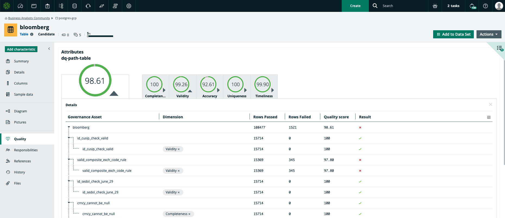

# DQ Connector

## Benefits

The Native DQ Connector brings intelligence from **Collibra Data Quality** into **Collibra Data Intelligence Cloud**. Once this integration is established, you will be able to bring in your Data Quality user-defined rules, metrics, and dimensions into **Collibra Data Catalog**.

_Please note: Only data sources ingested by both Collibra Data Catalog and Collibra Data Quality will be able to synchronize Data Quality assets_

## Step 0: Prerequisites

| **Resource**                     | Notes                                               |
| -------------------------------- | --------------------------------------------------- |
| Collibra Edge Site               | DQ Connector is a capability of Edge                |
| Collibra Data Intelligence Cloud | 2021.07 Release (or newer)                          |
| Collibra Data Quality            | 2.15 (or newer)                                     |
| Database(s) and Driver(s)        | Proper Access and Credentials (Username / Password) |


Let's proceed after gathering all prerequisites!


## Step 1: Create and Configure Edge and DQ Connector

**1A. Create Edge site and Add Name e.g. 'Collibra-DQ-Edge' and Description (One-Time)**


**Please see:** [**https://productresources.collibra.com/docs/cloud-edge/latest/Default.htm**](https://productresources.collibra.com/docs/cloud-edge/latest/Default.htm) **for more detailed information on Edge installation and configuration**


**1B. Establish Edge’s Connection To Each Data Source (One-Time For Each Source)**

Additional Steps in Collibra DG include:

* Provide Connection Name which exactly matches Connection / System Name in Collibra DQ
* Select Connection type e.g. Username / Password JDBC driver
* Input Username and Password to connect to your data source&#x20;
* Input fully qualified driver class name&#x20;
* Upload Driver jar (to reduce potential conflicts, use same driver jar from Collibra DQ)&#x20;
* Input Connection String Input credentials e.g. username / password or Kerberos config file&#x20;
* Reminder: All of the above information should be the same as in Collibra DQ

Additional Steps in Collibra DQ include:

* Verify Connection ‘Name’ in DGC matches Connection ‘Name’ in Collibra DQ
* Verify ‘Connection string’ in DGC matches ‘Connection URL’ in Collibra DQ
* Verify ‘Driver class name’ in DGC matches ‘Driver Name’ in Collibra DQ
* Verify ‘Driver jar’ in DGC matches Driver used in ‘Driver Location’ in Collibra DQ (may require SSH)


**Important: Connection / System name (in this example, ‘postgres-gcp’) must exactly match the Connection / System Name in Collibra DQ**


**1C. Establish Catalog JDBC Ingestion Capability On Edge (One-Time For Each Data Source)**

**1D: Configure Destinations For DQ Assets (Rules, Metrics, Dimensions) Within DQ Connector (One-Time)**

Option A: Create New Destinations

* Create New Rulebook Domain (suggested domain type) for DQ Rules and DQ Metrics
  * Global Create -> Search for and select 'Rulebook' under 'Governance Asset Domain' -> Select desired 'Community' e.g. 'Data Governance Council' -> Input name of Rulebook domain e.g. 'CDQ Rules', 'CDQ Metrics'


Record your domain resource ID e.g. 2xxxxxxx-xxxx-xxxx-xxxx-xxxxxxxxxxxx (can be found in your URL) for Step 1G


* Create New Business Asset Domain (suggested domain type) for DQ Dimensions
  * Global Create -> Search for and select 'Business Asset Domain' -> Select desired 'Community' e.g. 'Data Governance Council' -> Input name of domain e.g. 'CDQ Dimensions'
  * Record your domain resource ID e.g. 2xxxxxxx-xxxx-xxxx-xxxx-xxxxxxxxxxxx (can be found in your URL)

Option B: Use Existing Domains from existing Rulebook and Asset domains


Record your domain resource ID e.g. 2xxxxxxx-xxxx-xxxx-xxxx-xxxxxxxxxxxx (can be found in your URL) for Step 1G



You have now established destinations for where Collibra should ingest your User-Defined Rules, Metrics, and Dimensions


**1E. Assign Permissions for New Domains of DQ Assets (Rules, Metrics, Dimensions) (One-Time)**

Please assign your Edge user as a 'Technical Steward' in each of the domains specified in 1D such that  Edge can write create / update assets into each respective domain


This step provides Edge with the proper permissions to create and update assets into the domains from the previous step


**1F. Allow DQ Assets To Attach To Tables and Column Assets (One-Time)**

Now we need to add a few relations and update global assignment characteristics

* **Table**: Settings -> Operating Model -> Relations -> Search in any column for 'Table' -> Global Assignment -> Characteristics -> Edit (larger of the two buttons) on right -> Add characteristic -> Search for and select 'governed by Governance Asset' -> Save

* **Column**: Settings -> Operating Model -> Relations -> Search in any column for 'Column' -> Global Assignment -> Characteristics -> Edit (larger of the two buttons) on right -> Add characteristic -> Search for and select 'is governed by Data Quality Rule' -> Save

**1G. Establish DQ Connector (One-Time)**

DQ Connector is an Edge capability that will facilitate communication with your Collibra DQ instance

* Settings -> Edge -> Capabilities -> Add Capability -> Select 'DQ Connector' -> Input your Collibra DQ URL e.g. 'customerdq.collibra.com:port' input username and password


Remember from previous step 1D, you will need to provide your resource / UUIDs for your specified domains for DQ Rules, Metrics, and Dimensions


**Specify DQ Asset Destinations Within DQ Connector**


Excellent! We've now completed the initial one-time configuration!


## Step 2: Register Edge Connections to Collibra Catalog

**2A. Create System Asset Within Collibra Catalog To Connect To Edge**


**Important: Connection / System name (in this example, ‘postgres-gcp’) must exactly match the Connection / System Name in Collibra DQ**


**2B. Register Edge Data Source to Collibra Catalog**

## **Step 3: Start Ingesting Collibra Data Quality Into Catalog**


**Prerequisite: Catalog will have ingested schemas on Edge**



**Prerequisite: Ensure targeted schemas have User-defined Rules, Metrics, and/or Dimensions within Collibra DQ that have been Executed**


**3A. Synchronize Data Quality for Selected Schemas**

**3B. Verify Data Quality Results in Collibra Catalog**


**Success! Example Output**


**Appendix: Synchronization For Single Table in Data Quality and Data Catalog**

.png>)

## FAQ

**Q: Known Limitations**

* Only 1 source tenant from Collibra DQ can be specified
* On-demand ingestion (vs. scheduled)
* Can only specify 1 domain destination for each of Rules, Metrics, and Dimensions
* Only JDBC sources supported (no file sources)

**Q: DQ Dashboard In DGC: I can verify the DQ Connector is synchronizing Data Quality Rules and Data Quality Metrics, but why don't Data Quality Dashboard Charts display?**

A: Ensure correct **Aggregation Paths** and **Global Assignments** (or create, if none exist) for **Table** and **Column** below

**Q: DQ Dashboard In DGC: Why won't my DQ Dimension charts display in my Dashboard?**

A: Please 1) add a new custom **Relation** 'Data Quality Metric classified by Data Quality Dimension',  2) **Global Assignment** for 'Data Quality Metric', 3) UUID of the new **Relation** into the **DQ Connector** setup in **Step 1G**, 4)&#x20;

**Q: I've connected and configured data sources correctly, why aren't DQ Rules and DQ Metrics being synchronized?**

A: Please ensure Connection / System Names between Collibra Data Quality, Collibra, and Edge exactly match

A: Please ensure Edge user has admin permissions to write the assets into Catalog

A: Please ensure correct URL specified within the DQ Connector capability e.g. http://cdq.customer.com:9000/

**Q: Is DQ Connector unidirectional?**

A: Yes, from Collibra DQ to Collibra Catalog in Data Intelligence Cloud

**Q: How many DQ Connectors can I run simultaneously?**

A: Currently, one.

**Q: Does the DQ Connector work with On-Prem Collibra DGC?**

A: No, any work with on-prem Collibra DGC would be custom API development via Collibra Professional Services or a partner SI.

**Q: If I delete a rule from Collibra DQ that I have already synchronized into Collibra Catalog, will it be deleted from Catalog in the next synchronization?**

A: No, the DQ Connector only upserts into Catalog. If a rule is deleted from Collibra DQ, it will not be automatically deleted in Catalog.

**Q: Why are my scores different in Collibra DQ and Collibra Catalog?**

A: Currently, the DQ DQ Connector pulls in the most recent user-defined rules from Collibra DQ. Other components that affect score such as Behaviors, Outliers, Patterns, Dupes, Source are not yet included.

**Q: Getting errors when trying to delete both domain that Edge created for DB and the Connection?**

A: Please delete Edge created domain via API.

**Q: I've hit the synchronize button, how can I tell if my job is complete?**

A: Check the Activities circle (button on top right of menu) for the status of your DQ Synchronization.
