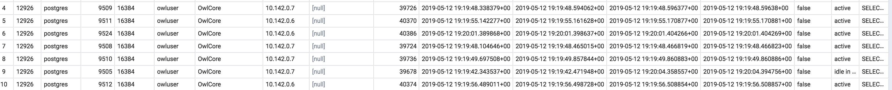

# Performance Tuning

| Storage Format | <p>Num</p><p>Rows</p> | <p>Num</p><p>Columns</p> | Bytes Disk | <p>Num</p><p>Executors</p> | Executor Memory | Total RAM | Transfer Time | Process Time |
| -------------- | --------------------- | ------------------------ | ---------- | -------------------------- | --------------- | --------- | ------------- | ------------ |
| Local File     | 1M                    | 50                       | 1G         | 1                          | 3G              | 3G        | 0 mins        | 2 mins       |
| HDFS File      | 10M                   | 50                       | 5G         | 3                          | 8G              | 24G       | 0 mins        | 4 mins       |
| Hive Table     | 10M                   | 50                       | 5G         | 3                          | 8G              | 24G       | 0 mins        | 4 mins       |
| JDBC Table     | 50M                   | 50                       | 25G        | 8                          | 10G             | 80G       | 3 mins        | 8 mins       |
| JDBC Table     | 10M                   | 100                      | 10G        | 3                          | 12G             | 36G       | 3 mins        | 6 mins       |
| JDBC Table     | 250M                  | 9                        | 10G        | 5                          | 7G              | 35G       | 14 mins       | 15 mins      |
| JDBC Table     | 250M                  | 145                      | 70G        | 17                         | 12G             | 204G      | 28 mins       | 30 mins      |

Using a 10/1 ratio of RAM to Executors is often a good rule of thumb, another and more simple option is to turn on dynamic.allocation and allow the resources to be provided as needed on demand.  

### Limit Columns

In most cased there are a large number of columns that go unused by the business or columns that don't require checking.  One of the most efficient things you can do is limit the cols using the below cmds.  As a best practice Owl strongly recommends using less than 80 columns per dataset.

```bash
-q "select colA, colB, colC, datCol, colD from table"
// vs
-q "select * from * from table"
```

#### How to limit columns when using a file

```bash
-fq "select colA, colB, colC from dataset"
// file query using keyword dataset
```

## JDBC vs Local Data

#### Co-Located data  (local data)

It is always a good performance practice to colocate data and processing.  That doesn't mean that you tech organization chooses to do this in it's architecture and design which is why Owl accounts for both.  If the data is located on the cluster that is doing the processing use options like -hive for non JDBC and native file access.  Skip tuning for JDBC as moving data to the cluster first will routinely reduce 50% of the performance bottleneck.

#### JDBC

**Set fetchsize **\
1M rows   -connectionprops fetchsize=1000\
5M rows   -connectionprops fetchsize=5000\
10M rows   -connectionprops fetchsize=10000

**Set DriverMemory**\
add more memory to the driver node as it will be responsible for the initial landing of data.\


```
--driver-memory 7g
```

**Add Parallel JDBC**



### Limit Features, Turn Flags Off

```
-corroff    //only losing visuals, 5% speed gain
-histoff    //only losing visuals, 4% speed gain 
-hootonly   //speeds up 1% based on less logging
-readonly   //remove owl webapp read writes, 1% gain
-datashapeoff //removes Shape Detection 3% speed gain
```

### Real World Scenario

9 Million rows with 46 columns on a daily basis for just 1 dataset.  The data lives in Greenplum and we want to process it on a cluster platform where Owl runs.  The first run results in a 12 minute runtime.  While acceptable it's not ideal, here is what you should do.

1. Add Parallel JDBC for faster network 
2. Limit columns to the 18 that are of use in the downstream processing
3. Turn off unneeded features. 
4. Find out of the job is memory bound or CPU bound

By setting the below configs this same job ran in 6 mins.

```bash
# parallel functions
-columnname run_date -numpartitions 4 \
-lowerbound "2019-02-23 00:00:00" \
-upperbound "2019-02-24 00:00:00"
# driver optimization
-connectionprops fetchsize=6000
# analyst functions
-corroff \
-histoff
# hardware
-executormemory 4g
-numexecutors 3
```

#### The Full OwlCheck

```bash
./owlcheck  \
-u u -p pass  \
-c jdbc:postgresql://$host/postgres \                   # jdbc url
-ds aumdt  -rd 2019-05-05  \
-q "select * from aum_dt"  \
-driver org.postgresql.Driver \                         # driver
-lib /home/owl/drivers/postgres  \                      # driver jar
-connectionprops fetchsize=6000 \                       # driver performance setting
-master yarn -deploymode client \
-executormemory 2G -numexecutors 2 -drivermemory 3g \   # hardware sizing
-h cdh-edge.us-east1-b.c.owl-hadoop-cdh.internal:2181 \ # owl metastore
-corroff -histoff -statsoff \                           # owl features 
-loglevel INFO \                                        # log level 
-columnname updt_ts -numpartitions 12 \                 # parallel jdbc
-lowerbound 1557623033193 -upperbound 1557623051585
```

```aspnet
{
  "dataset": "aumdt",
  "runId": "2019-05-05",
  "score": 100,
  "behaviorScore": 0,
  "rows": 9000000,
  "passFail": 0,
  "peak": 0,
  "avgRows": 0,
  "cols": 46,
  "runTime": "00:05:23",
  }
```
