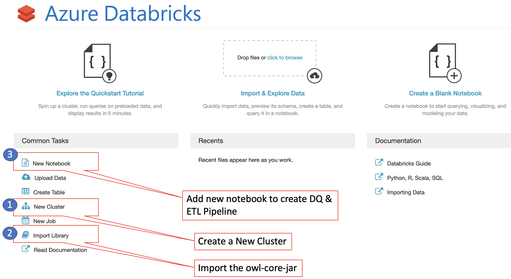

# Creating a Data Quality Pipeline

Organizations who leverage data as an asset in order to make decisions into their future have to entrust the data in which important business decisions are derived from. While almost all businesses leverage their own collected or generated data (or plan to) for internal use, I question how many actually scrutinize their data?  Companies who sell a product have to make sure the product is run through some sort of quality assurance suite of tests/runs before it lands in the hands of a customer. Well much the same, organizations who use data internally as their own asset/product should have the same or more confidence in the quality of their data. Owl-Analytics is a data quality product that observes the data in order to surface behaviors, patterns, outliers, schema changes, record changes, and more.  

Data Scientists are trying to find insights in data to solve complex problems for their business.  However, 80% of their time is spent discovering the data in order to cleanse the data to make it ready for the model. Over time models deteriorate as data underneath changes or new trends/ patterns arise.  Leveraging Owl-Analytics to validate the quality of the data during the data pipeline and before the data is presented to the Data Scientist will reduce time to value for business insights as Data Scientists will get time back not cleaning / prepping the data and helping the model maintain a longer life. 

Azure Databricks Allows the ability for Scala code to be written in a Jupyter Notebook against an Azure backed Databricks cluster in order to scale the work out to more nodes in order to support the model and the amount of data being crunched by a business’s data scientists. The simplistic nature of Azure and Databricks along with the unification of Spark and Jupyter Notebooks on top of a robust infrastructure from storage to compute allows for Owl-Analytics Data Qualified pipelines to be built and executed seamlessly reducing the time to valuable insights.

Here is how you can build such great DQ pipelines………

### Step 1: Build a Databricks Cluster in Azure.  

Within the Azure portal find Azure Databricks Service and create a cluster, after the cluster is built you should be able to launch the Workspace as shown below.

### Step 2: Create a Cluster, add the Owl jar and create a Notebook.

1.) Inside the Azure Databricks UI first create a cluster providing a cluster name (in this example we will be using DBOWL2 as the cluster name) and selecting the Databricks Runtime Version that Owl current supports (as of this blog post) which is Runtime: 5.2(Scala 2.11, Spark 2.4.0). 

2.) After the Cluster is created make sure to import owl’s jar file onto the cluster so that theNotebook can access the methods exposed in the jar file.

 3.) Now that the Jar file has been added, create the Notebook and attach the notebook to the cluster.

Now the cluster is running with the Owl jar loaded on the cluster. Open the Jupyter notebook attached to the cluster and begin looking at a data set as a Data Engineer would, prepping the data for use by a Data Scientist by leveraging a DQ Pipeline as shown in the below screen shot.

\

.png>)

This Scala code imports the Owl jar and loops through the dates residing in files on Azure blob storage, pulls them into a Spark Data Frame (DF), and execute an Owl job to scan for the quality issues on the Spark DF. Once the scan is completed the results are stored into the metadata repository under Owl’s web application and visible through your browser as shown in Figure 4 below.

.png>)

The reason for a score of 49 on the raw data (as shown below in Figure 5) is due to the file having string values sprinkled in the file when something is Not Applicable (N.A.). When reading data in a column of a file that has a mix of numeric and string values the column will automatically conform to a string regardless if the majority class are integers. Also, within the files there is a single record in this file that has meta data information about the file “META_ZZ” this is also adding empty strings for all other columns. This record will also cause all columns to conform to strings.

.png>)

Now that we have an understanding of the raw file and how we need to conform it before analysts can start to glean business value from the contents itself. We first have to ETL or cleanse the data that we discovered as being errand by filtering out the erroneous record and flipping all the N.A. values to null as the next step in our ETL and DQ pipeline.

.png>)

The Owl block of code is essentially the same, however there is a new owl property added to auto filter values “props.nullValue = ‘N.A’”. This will find every cell that has the value of N.A. and conform it to a “null”. Once the file is read into a Spark DF then we use Spark to “Filter” out the erroneous record on line 36 in the code snippet above. Notice we are also adding an Owl_Run_ID date as this dataset did not have a date that conforms easily. After the ETL process cleanses the data, we then have Owl’s Data Quality engine scan the newly processed Spark DF storing the results into a dataset called CleanCSVFiles (as shown in Figure 7 below).

.png>)

Notice the composite scores in the boxes are substantially better for the CleanCSVFiles dataset than what they are for the original RawCSVFiles. In the next article we will look deeper at the intelligence an Owl scan can garner on a data set when run over several days and how Owl can surface different patterns, behaviors, trends and more in the data itself.

